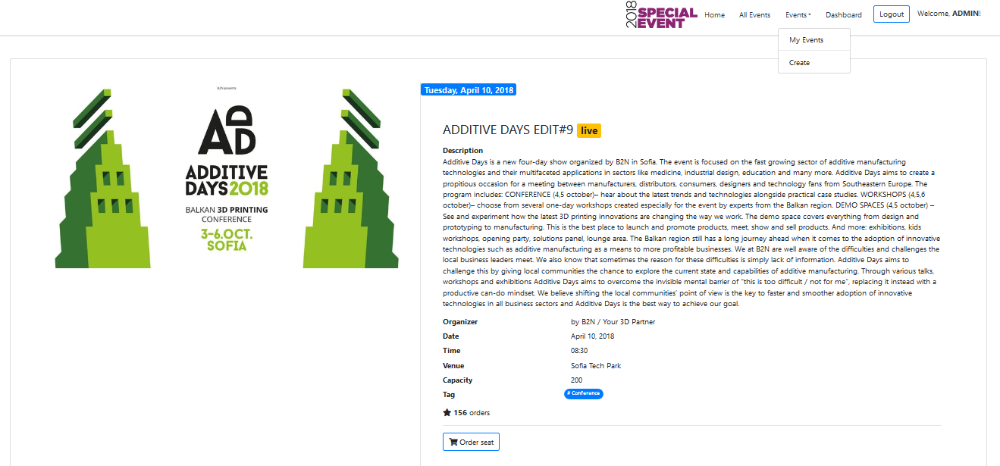
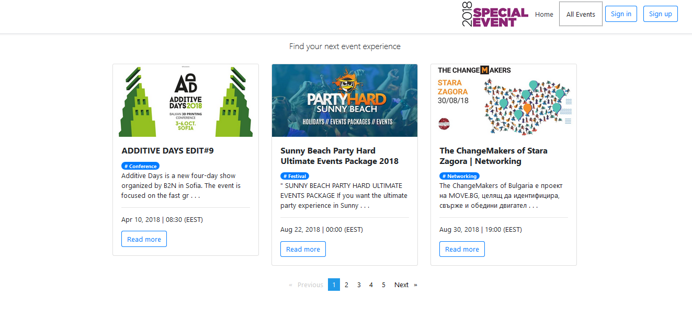




# SpaecialEvents

This web application using Angular 6 framework with Node.js and Kinvey back-end. It presents public and free events with event ticketing and registration pages in minutes. The application allows users to browse, create, claim and promote local events.

-	public part (accessible without authentication)
-	private part (available for registered users) 
-	administrative part (available for administrators only)


# Public Part

The public part is available for all users without authentication. The public part is start page, the user login and user registration forms, as well as the list with all available events with date and time and title. Unregistered users can not claim seat about events and read the details.

# Private Part (User Area)

Registered users has personal page (My Events) with personal created events in the web application accessible after successful login. Each registered user can read the short details (date and time, location, title, available seats, tags etc.), claim seats for event and create new events. Only created by himself stadiums can be modify and delete.

# Administration Part

System administrator has administrative access to the system and permissions to administer all major information objects in the application. Administrator can create, delete and update all events information, create, delete, edit, block, unblock users and their information. Administrator has personal (Dashboard) page with users information.

### Tech

SpecialEvents uses a number of open source projects to work properly:

* Angular 6 - platform that makes it easy to build applications with the web. The application combines declarative templates, dependency injection, components, decorators, data binding, observables, handling reactive forms, interceptors, router, guards to block access to certain routes and other.
* Bootstrap4 - great UI boilerplate for modern web apps
* Kinvey - evented I/O for the backend


### Installation
Install the dependencies and devDependencies and start the server.

```sh
$ npm install
$ ng serve 
```
Run ng serve for a dev server. Navigate to http://localhost:4200/. The app will automatically reload if you change any of the source files.


License
----
MIT


**Enjoy!**
 